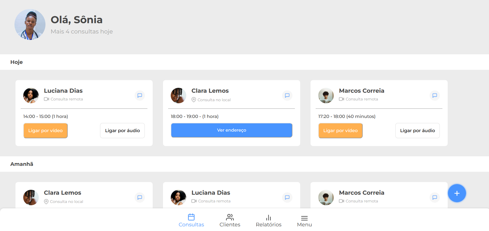

## 📸Imagem do projeto

  

## 🖥️Sobre o projeto
Esse é um projeto de uma página de consultas para clínicas, foi baseado em um <a href="https://www.figma.com/file/4OjHFmeHAgfX2JpRymOeA0/7days---Responsividade?type=design&node-id=6-622&mode=design&t=wwqUinzv4GDxe27Q-0">modelo do figma</a> disponibilizado pela Alura.

## 🚀Tecnologias utilizadas
Esse projeto foi desenvolvido durante o 7 days of code da Alura com as seguintes tecnologias: 
-HTML 
-CSS 
-Alura 
-Git e GitHub